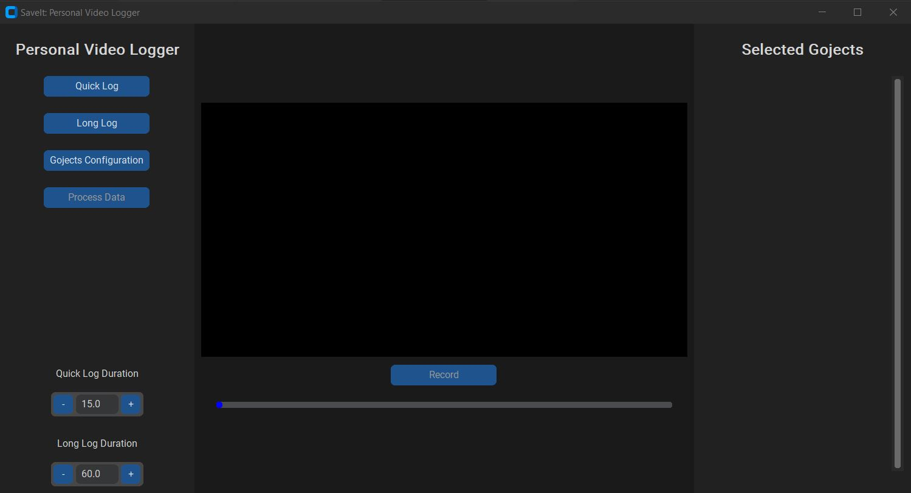

# SaveIt: Personal Video Logger

<div align="center">


</div>

Automation for video logging progress and reflexions about goals, projects, and research (Gojects). Kinda like the characters on the first avatar movie. Notion integration WIP.




## 💻 Requirements

Before downloading, certify that you have the following requirements:
* You have the most recent version of `python`
* Your operating system is `Windows / Linux` based.

## 🚀 Installing SaveIt: Personal Video Logger

To run SaveIt: Personal Video Logger, run the following commands:

```
pip install requirements.txt
```

Lauching the application:

```
python3 main.py
```
## Current Version: 1.0.0

This software is currently a work in progress. The current version is capable of:

<details open>
<summary>Version 1.1.0 Features</summary>

- [x] Execution by command line (see [Installation](#🚀-Installing-SaveIt:-Personal-Video-Logger))
- [ ] Manage Goals and Projects:
  - [x] Edit Gojects Window
    - [x] Create Gojects
    - [x] Delete Gojects
    - [x] Edit Gojects
    - [x] Save Gojects
  - [ ] Select Gojects to record
    - [x] Create custom widget to aggragate information of recording progress
    - [x] Show custom widgets on the right sidebar
- [x] Recording:
  - [x] Quick Log Recording (less than one minute)
    - [x] Custom widget to set timer duration as a dial
  - [x] Long Log Recording (more than one minute)
    - [x] Custom widget to set timer duration as a dial
  - [x] Folder manager 

</details>

<details>
<summary>Version 1.2.0 Features</summary>

- [ ] Execution by executable
- [ ] Gojects:
  - [ ] Add attribute of parent/child goject
  - [ ] Create visual representation of parent/child goject (as a pathway visualizer)
- [ ] Recording:
  - [ ] Show recording on the main menu (currently opens up another window)
    - [ ] Create progress bar for the whole duration of the log
    - [ ] Create button to stop current log and go to next one
    - [ ] Create button to go to next section of current log
    - [ ] Create button to stop recording
  - [ ] Create sections for each log during recording (not restricted to):
    - [ ] Introduction
    - [ ] Reflexion
    - [ ] Conclusion
- [ ] Log Data Processing
  - [ ] Audio Transcription
  - [ ] Computer Vision Sentiment Analysis
  - [ ] Log Manager Window:
    - [ ] Compile Logs
    - [ ] Compress Logs Compilation
    - [ ] Clean Logs Older Than 6 months
    - [ ] Generate Report with overall sentiment and summary of reflexions
</details>


<details>
<summary>Version 1.3.0 Features</summary>

- [ ] Video Player:
  - [ ] Create class to play recording on the main menu:
    - [ ] Select and play older logs
    - [ ] Play other videos
- [ ] Notion API integration
  - [ ] Import
  - [ ] Edit and Save

</details>

## 📝 License

See [License](LICENSE) for more information.

[⬆ Back to the top](#SaveIt:-Personal-Video-Logger)<br>

